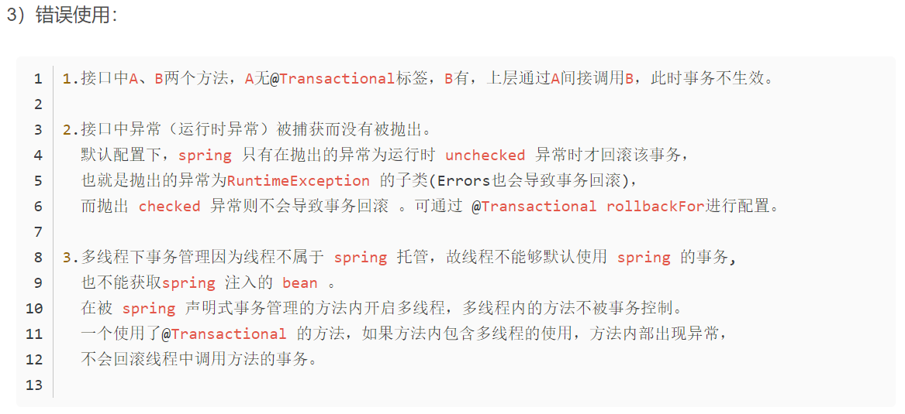
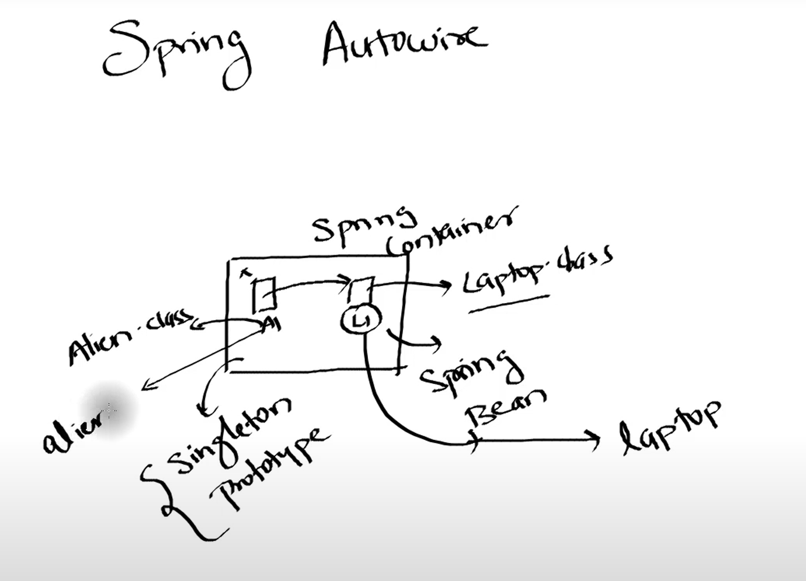

## JAVA EE 

### singletonList(key)

```
Long stock = (Long) jedisClient.eval(script, Collections.singletonList(key), Collections.emptyList());
```

**singletonList return immutable list with only one object**



### @Transactional

数据库应用程序通常通过事务而不是单个操作访问数据库。例如，大型数据库和数百个并发用户：银行、超市收银台、机票预订、在线购买等。
之所以使用事务是因为它们可以在以下情况下实施数据完整性：多个用户可以同时修改和共享数据；事务、系统和媒体故障可能不时发生。

从高级语言的角度（如 SQL）
插入（INSERT）、选择（SELECT）、更新（UPDATE）、删除（DELETE）
开始（BEGIN）、提交（COMMIT）、中止（ABORT）/ 回滚（ROLLBACK）等;

在执行SQL语句的时候，某些业务要求，一系列操作必须全部执行，而不能仅执行一部分。例如，一个转账操作：


```sql
-- 从id=1的账户给id=2的账户转账100元
-- 第一步：将id=1的A账户余额减去100
UPDATE accounts SET balance = balance - 100 WHERE id = 1;
-- 第二步：将id=2的B账户余额加上100
UPDATE accounts SET balance = balance + 100 WHERE id = 2;
```

这两条SQL语句必须全部执行，或者，由于某些原因，如果第一条语句成功，第二条语句失败，就必须全部撤销。

这种把多条语句作为一个整体进行操作的功能，被称为数据库*事务*。数据库事务可以确保该事务范围内的所有操作都可以全部成功或者全部失败。如果事务失败，那么效果就和没有执行这些SQL一样，不会对数据库数据有任何改动。

可见，数据库事务具有ACID这4个特性：

- A：Atomic，原子性，将所有SQL作为原子工作单元执行，要么全部执行，要么全部不执行；
- C：Consistent，一致性，事务完成后，所有数据的状态都是一致的，即A账户只要减去了100，B账户则必定加上了100；
- I：Isolation，隔离性，如果有多个事务并发执行，每个事务作出的修改必须与其他事务隔离；
- D：Duration，持久性，即事务完成后，对数据库数据的修改被持久化存储。

对于单条SQL语句，数据库系统自动将其作为一个事务执行，这种事务被称为*隐式事务*。

要手动把多条SQL语句作为一个事务执行，使用`BEGIN`开启一个事务，使用`COMMIT`提交一个事务，这种事务被称为*显式事务*，例如，把上述的转账操作作为一个显式事务：

```sql
BEGIN;
UPDATE accounts SET balance = balance - 100 WHERE id = 1;
UPDATE accounts SET balance = balance + 100 WHERE id = 2;
COMMIT;
```

很显然多条SQL语句要想作为一个事务执行，就必须使用显式事务。

`COMMIT`是指提交事务，即试图把事务内的所有SQL所做的修改永久保存。如果`COMMIT`语句执行失败了，整个事务也会失败。

有些时候，我们希望主动让事务失败，这时，可以用`ROLLBACK`回滚事务，整个事务会失败：

```sql
BEGIN;
UPDATE accounts SET balance = balance - 100 WHERE id = 1;
UPDATE accounts SET balance = balance + 100 WHERE id = 2;
ROLLBACK;
```

### 隔离级别

对于两个并发执行的事务，如果涉及到操作同一条记录的时候，可能会发生问题。因为并发操作会带来数据的不一致性，包括脏读、不可重复读、幻读等。数据库系统提供了隔离级别来让我们有针对性地选择事务的隔离级别，避免数据不一致的问题。

SQL标准定义了4种隔离级别，分别对应可能出现的数据不一致的情况：

| Isolation Level  | 脏读（Dirty Read） | 不可重复读（Non Repeatable Read） | 幻读（Phantom Read） |
| :--------------- | :----------------- | :-------------------------------- | :------------------- |
| Read Uncommitted | Yes                | Yes                               | Yes                  |
| Read Committed   | -                  | Yes                               | Yes                  |
| Repeatable Read  | -                  | -                                 | Yes                  |
| Serializable     | -                  | -                                 | -                    |

**1 .添加位置**

1）接口实现类或接口实现方法上，而不是接口类中。
2）访问权限：public 的方法才起作用。@Transactional 注解应该只被应用到 public 方法上，这是由 Spring [AOP](https://so.csdn.net/so/search?q=AOP&spm=1001.2101.3001.7020) 的本质决定的。
系统设计：将标签放置在需要进行事务管理的方法上，而不是放在所有接口实现类上：只读的接口就不需要事务管理，由于配置了@Transactional就需要AOP拦截及事务的处理，可能影响系统性能。


## Auto Wired and Resource(injection)

**@Auto wired 协助 spring alien object 找到 laptop object， （find by type）**

**@Autowired注解是按照类型（byType）装配依赖对象，默认情况下它要求依赖对象必须存在，如果允许null值，可以设置它的required属性为false。如果我们想使用按照名称（byName）来装配，可以结合@Qualifier注解一起使用。(通过类型匹配找到多个candidate,在没有@Qualifier、@Primary注解的情况下，会使用对象名作为最后的fallback匹配)如下：**

```java
public class TestServiceImpl {
    @Autowired
    @Qualifier("userDao")
    private UserDao userDao; 
}
```

**@Resource默认按照ByName自动注入，由J2EE提供，需要导入包javax.annotation.Resource。@Resource有两个重要的属性：name和type，而Spring将@Resource注解的name属性解析为bean的名字，而type属性则解析为bean的类型。所以，如果使用name属性，则使用byName的自动注入策略，而使用type属性时则使用byType自动注入策略。如果既不制定name也不制定type属性，这时将通过反射机制使用byName自动注入策略。**

```java
public class TestServiceImpl {
    // 下面两种@Resource只要使用一种即可
    @Resource(name="userDao")
    private UserDao userDao; // 用于字段上
    
    @Resource(name="userDao")
    public void setUserDao(UserDao userDao) { // 用于属性的setter方法上
        this.userDao = userDao;
    }
}
```


**run 返回的 context 就是 spring container**

**@component （可以改名字） 在container生成的时候生成创建一次single-turn object (bean)**

**可以通过getbean（）找到Alien 类型的bean**




**Alien.java**

**声明上@Scope（value = “prototype")，只有在context.bean()的时候才会创建相应的object， springframework 不会自动生成一个object**


```java
package com.example.demo;

import org.springframework.beans.factory.annotation.Autowired;
import org.springframework.beans.factory.annotation.Qualifier;
import org.springframework.context.annotation.Scope;
import org.springframework.stereotype.Component;

@Component
public class Alien {

	private int aid;
	private String aname;
	private String tech;
	@Autowired
	@Qualifier("lap1")
	private Laptop laptop;
	
	public Alien() {
		super();
		System.out.println("object created..");
	}
	public int getAid() {
		return aid;
	}
	public void setAid(int aid) {
		this.aid = aid;
	}
	public String getAname() {
		return aname;
	}
	public void setAname(String aname) {
		this.aname = aname;
	}
	public String getTech() {
		return tech;
	}
	public void setTech(String tech) {
		this.tech = tech;
	}
	public Laptop getLaptop() {
		return laptop;
	}
	public void setLaptop(Laptop laptop) {
		this.laptop = laptop;
	}
	public void show() 
	{
		System.out.println("in show");
		laptop.compile();
	}
}
```

**DemoApplication.java**

```java
package com.example.demo;

import org.springframework.boot.SpringApplication;
import org.springframework.boot.autoconfigure.SpringBootApplication;
import org.springframework.context.ConfigurableApplicationContext;

@SpringBootApplication
public class DemoApplication {

	public static void main(String[] args) {
		ConfigurableApplicationContext context =  SpringApplication.run(DemoApplication.class, args);
		Alien a = context.getBean(Alien.class);
		a.show();

	}

}
```

**Laptop.java**

```java
package com.example.demo;

import org.springframework.stereotype.Component;

@Component("lap1")
public class Laptop
{
	private int lid;
	private String brand;
	public int getLid() {
		return lid;
	}
	public void setLid(int lid) {
		this.lid = lid;
	}
	public String getBrand() {
		return brand;
	}
	public void setBrand(String brand) {
		this.brand = brand;
	}
	@Override
	public String toString() {
		return "Laptop [lid=" + lid + ", brand=" + brand + "]";
	}
	
	public void compile() {
		System.out.println("compiling");
	}
}
```

## 前端变量获取

### Controller 类

**这个controller 根据return string 取渲染 templates 下的 add_activity.html**

```java
package com.zhenghao.seckill.web;

import org.springframework.stereotype.Controller;
import org.springframework.web.bind.annotation.RequestMapping;

@Controller
public class SeckillActivityController {
    @RequestMapping("/addSeckillActivity")
    public String addSeckillActivity(){
        return "add_activity";
    }
}

```

**或者声明一个 ModelAndView() **

**setViewName 声明html的名字**

```java
ModelAndView modelAndView = new ModelAndView();
//塞东西进去
modelAndView.addObject("orderNo",<>）;
modelAndView.setViewName("seckill_result");
```

**@Responsebody表示直接返回，不渲染**

前端输入获取

```java
@RequestParam("name")
```

path variable 获取

```java
 @RequestMapping("/item/{seckillActivityId}")
    public String itemPage(Map<String,Object> resultMap,@PathVariable long seckillActivityId){}
```

## controller 类对Service 类

 **Controller 类调用service 类**

## Configuration bean

### 直接在config 声明bean 返回的对象

**factory 先去appconfig.class 寻找配置（需用@configuration 声明是配置类）**

**通过getbean（）获取samsung object 但是需要首先在appconfig.class 里声明@bean**


**APP.java**

```java
package com.telusko.SpringAnno;

import org.springframework.context.ApplicationContext;
import org.springframework.context.annotation.AnnotationConfigApplicationContext;

/**
 * Hello world!
 *
 */
public class App 
{
    public static void main( String[] args )
    {
    	ApplicationContext factory = new AnnotationConfigApplicationContext(AppConfig.class);
    	
        Samsung s7 = factory.getBean(Samsung.class);
        s7.config();
    }
}
```

**Appconfig.java**

**其实这些bean 是xml的一个替代品**

```java
package com.telusko.SpringAnno;

import org.springframework.context.annotation.Bean;
import org.springframework.context.annotation.Configuration;

@Configuration
public class AppConfig
{
	@Bean
	public Samsung getPhone() 
	{
		return new Samsung();
	}
	
	@Bean
	public MobileProcessor getProcessor()
	{
		return new Snapdragon();
	}
}
```

**MobileProcessor.java**

```java
package com.telusko.SpringAnno;

public interface MobileProcessor 
{
	void process();
}
```

**Samsung.java**

```java
package com.telusko.SpringAnno;

import org.springframework.beans.factory.annotation.Autowired;

public class Samsung
{
	@Autowired
	MobileProcessor cpu;

	public MobileProcessor getCpu() {
		return cpu;
	}

	public void setCpu(MobileProcessor cpu) {
		this.cpu = cpu;
	}

	public void config() 
	{
		System.out.println("Octa Core,4 gb Ram, 12MP camera");
		cpu.process();
	}
}
```

**MobileProcessor.java**

```java
package com.telusko.SpringAnno;

public class Snapdragon implements MobileProcessor {

	public void process() {
		System.out.println("World Best CPU");

	}

}
```

### 使用component scan

**在声明每个类型的component 后在 config 加入@configuration 下面@ componentscan（basePackages = “包含所有component 的package”），这样子就不需要加入@bean了**

**mediatek.java**

```java
package com.telusko.SpringAnno;

import org.springframework.context.annotation.Primary;
import org.springframework.stereotype.Component;

@Component

public class MediaTek implements MobileProcessor 
{

	public void process() 
	{
		System.out.println("2nd Best CPU");

	}

}
```

**Samsung.java**

```java
package com.telusko.SpringAnno;

import org.springframework.beans.factory.annotation.Autowired;
import org.springframework.beans.factory.annotation.Qualifier;
import org.springframework.stereotype.Component;

@Component  
public class Samsung
{
	@Autowired
	@Qualifier("snapdragon")
	MobileProcessor cpu;

	public MobileProcessor getCpu() {
		return cpu;
	}

	public void setCpu(MobileProcessor cpu) {
		this.cpu = cpu;
	}

	public void config() 
	{
		System.out.println("Octa Core,4 gb Ram, 12MP camera");
		cpu.process();
	}
}
```

**Appconifg.java**

```java
package com.telusko.SpringAnno;

import org.springframework.context.annotation.Bean;
import org.springframework.context.annotation.ComponentScan;
import org.springframework.context.annotation.Configuration;

@Configuration
@ComponentScan(basePackages="com.telusko.SpringAnno")
public class AppConfig
{

}
```

**Snapdragon.java**

```java
package com.telusko.SpringAnno;

import org.springframework.context.annotation.Primary;
import org.springframework.stereotype.Component;

@Component

public class Snapdragon implements MobileProcessor {

	public void process() {
		System.out.println("World Best CPU");

	}

}
```


## 同一个interface，两个class

**通过@Qualifier（“名字”） 匹配component（“名字”）寻找 object 的instance name**

**或者@primary**


### config 获取application.properties

```java
@Value("${spring.redis.timeout}")
```

## 其他标注

```
@service 标注 服务
```

## 获取logger

```java

private Logger logger = LoggerFactory.getLogger(JedisConfig.class);
```

## 测试时需要注意的

**声明@springboottest**

**可以右键class 的名字里直接生成各种method 的测试方法**

## 启动spring时候就调用方法


```java
@Component
public class RedisPreheatRunner  implements ApplicationRunner {}
```

## lombok 依赖

```java
拿lombok官网的一个例子来说:
public class Mountain{
    private String name;
    private double longitude;
    private String country;
}    要使用这个对象,必须还要写一些getter和setter方法,可能还要写一个构造器、equals方法、或者hash方法.这些方法很冗长而且没有技术含量,我们叫它样板式代码.   lombok的主要作用是通过一些注解，消除样板式代码，像这样：
@Data
public class Mountain{
    private String name;
    private double longitude;
    private String country;
}

```

## Rocket MQ JVM注意事项

使用版本4.7.0

```
start mqnamesrv.cmd
start mqbroker.cmd -n 127.0.0.1:9876 autoCreateTopicEnable=true
```

**classpath前后需要加上“”**


```shell
rem ===========================================================================================
rem  JVM Configuration
rem ===========================================================================================
set "JAVA_OPT=%JAVA_OPT% -server -Xms256m -Xmx256m"
set "JAVA_OPT=%JAVA_OPT% -XX:+UseG1GC -XX:G1HeapRegionSize=16m -XX:G1ReservePercent=25 -XX:InitiatingHeapOccupancyPercent=30 -XX:SoftRefLRUPolicyMSPerMB=0 -XX:SurvivorRatio=8"
set "JAVA_OPT=%JAVA_OPT% -verbose:gc -Xloggc:"%USERPROFILE%\mq_gc.log" -XX:+PrintGCDetails -XX:+PrintGCDateStamps -XX:+PrintGCApplicationStoppedTime -XX:+PrintAdaptiveSizePolicy"
set "JAVA_OPT=%JAVA_OPT% -XX:+UseGCLogFileRotation -XX:NumberOfGCLogFiles=5 -XX:GCLogFileSize=30m"
set "JAVA_OPT=%JAVA_OPT% -XX:-OmitStackTraceInFastThrow"
set "JAVA_OPT=%JAVA_OPT% -XX:+AlwaysPreTouch"
set "JAVA_OPT=%JAVA_OPT% -XX:MaxDirectMemorySize=1g"
set "JAVA_OPT=%JAVA_OPT% -XX:-UseLargePages -XX:-UseBiasedLocking"
set "JAVA_OPT=%JAVA_OPT% -Drocketmq.client.logUseSlf4j=true"
set "JAVA_OPT=%JAVA_OPT% -cp "%CLASSPATH%""

"%JAVA%" %JAVA_OPT% %*
```

