# concepts

QPS 即**Queries Per Second**

MySQL 数据库单点能支撑 1000 QPS，但是 Redis10 W

"原子操作(atomic operation)是不需要synchronized"，这是多线程编程的老生常谈了。 所谓原子操作是指**不会被线程调度机制打断的操作**；这种操作一旦开始，就一直运行到结束，中间不会有任何context switch （切换到另一个线程）。

## My batis 逆向生成

这里要配置mybatis 生成器和数据的连接配置

生成后 resources 有XML 的数据库映射文件

另外会生成相应的main 底下mapper 操作文件

#### PO类

```
domainObjectName 对应po类
```

**这个Po类里可以理解成一个entity，然后可以直接调用**

**例如 在秒杀系统里 秒杀活动服务的 create order 方法 调用Order order = new Order();** 

#### Mapper 里的*.XML

```
1、首先定义一个sql标签，一定要定义唯一id<sql id="Base_Column_List" >字段名1,字段名2</sql>
2、然后通过id引用
<select id="selectAll">
select
<include refid="Base_Column_List" />
    from 表名
</select>

这时<include refid="Base_Column_List" />会自动把上面的代码贴过来。

数据库中查询的语句就可以解析为：select 字段名1，字段名2  from 表名
```

**已经定义了，相当于***

```xml
<sql id="Base_Column_List">
    id, name, commodity_id, old_price, seckill_price, activity_status, start_time, end_time, 
    total_stock, available_stock, lock_stock
  </sql>
```


## 启动类 自动扫描生成到的包

**在application 那里导入就好**

**一个是mapperScan** 

**一个是componentScan**

```
@MapperScan("com.zhenghao.seckill.db.mappers")
@ComponentScan(basePackages = {"com.zhenghao"})
```

## Properties 配置数据库连接

```java
#配置端口 tomcat

JDBC 驱动

datasource.url = mysql 地址/<数据库名>

username

password

#mybatis 

数据库映射的位置（resources底下的）

mybatis.mapper-locations:classpath:mappers/*.xml


```

**单元测试数据库连接，看是否能更新表**

## DAO 配置

**DAO数据访问层是处理业务代码，在MAPPER 上包了一层，**

**DAOImpl.java 里overvide DAO接口 的方法， DAOImpl.java 注入mapper 通过XXmapper.xml 方法访问数据库**

**（需要@resource 注入mapper 的底层代码）**


## Jmeter

可以并行的短时间发送多个请求

## 并行错误

**可以并行执行select 语句的，**

**但是update不可以并行执行，update 语句是串行的**

**容易出现错误**


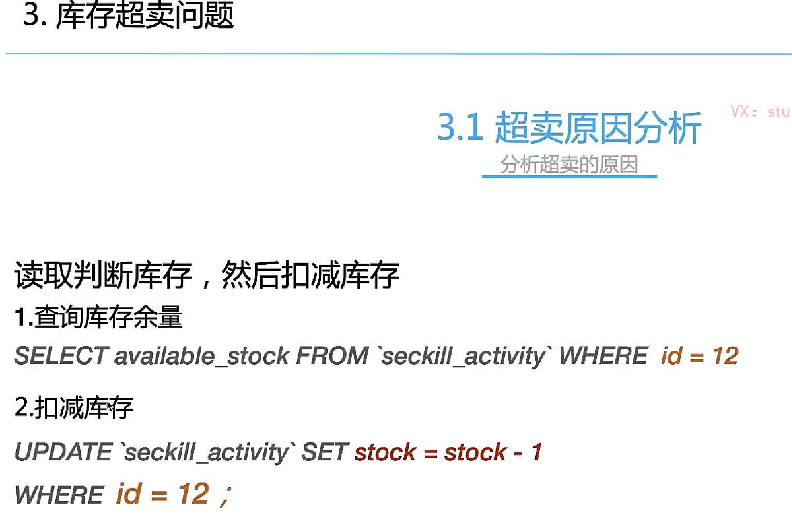


### 乐观锁

**在update 的时候基于数据库 增加判断库存statement**

**大量的请求到数据库，容易crash**

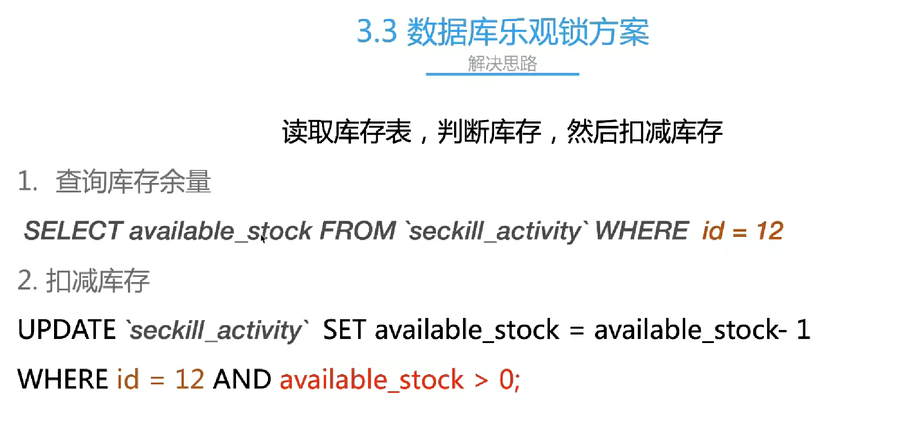

### **lua 脚本 redis** 

Redis 启动


**高效的组合多个命令，redis 挡住大部分请求，保护数据库**

**lua脚本合并select 和update 操作**

**创建订单的时候也会锁定订单double check**

**redis 读取lua 脚本**

**用 1 为基址的形式访问( KEYS[1] ， KEYS[2] ，以此类推)**

```java
  String script = "if redis.call('exists',KEYS[1]) == 1 then\n" +
                    "                 local stock = tonumber(redis.call('get', KEYS[1]))\n" +
                    "                 if( stock <=0 ) then\n" +
                    "                    return -1\n" +
                    "                 end;\n" +
                    "                 redis.call('decr',KEYS[1]);\n" +
                    "                 return stock - 1;\n" +
                    "             end;\n" +
                    "             return -1;";
```

```java
 public boolean stockDeductValidator(String key)  {
        try(Jedis jedisClient = jedisPool.getResource()) {
            //用 1 为基址的形式访问( KEYS[1] ， KEYS[2] ，以此类推)
            String script = "if redis.call('exists',KEYS[1]) == 1 then\n" +
                    "                 local stock = tonumber(redis.call('get', KEYS[1]))\n" +
                    "                 if( stock <=0 ) then\n" +
                    "                    return -1\n" +
                    "                 end;\n" +
                    "                 redis.call('decr',KEYS[1]);\n" +
                    "                 return stock - 1;\n" +
                    "             end;\n" +
                    "             return -1;";
            //singlet
            Long stock = (Long) jedisClient.eval(script, Collections.singletonList(key), Collections.emptyList());
            if (stock < 0) {
                System.out.println("库存不足");
                return false;
            } else {
                System.out.println("恭喜，抢购成功");
            }
            return true;
        } catch (Throwable throwable) {
            System.out.println("库存扣减失败：" + throwable.toString());
            return false;
        }
    } 
```


## 整体流程

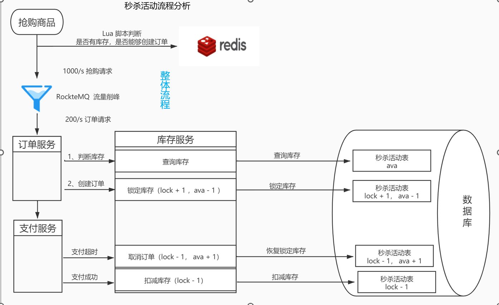


### RocketMQ 流量冲击

削峰填谷

异步解耦

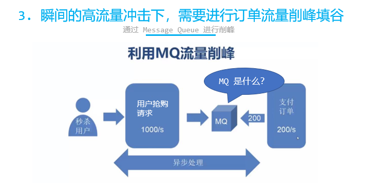

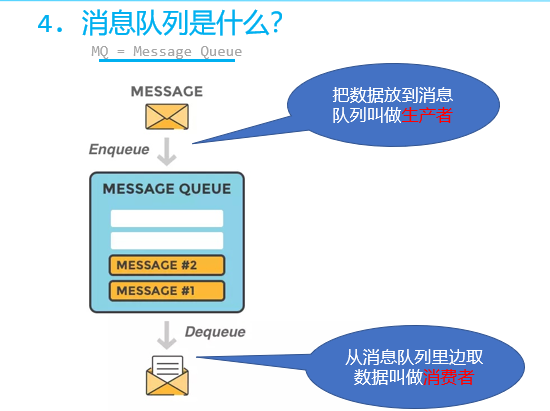


### RokcetMQ

**Consumer**

```java
public class PayStatusCheckListener implements RocketMQListener<MessageExt> {}
```

**producer**

```java
* 3.发送订单付款状态校验消息
         * 开源RocketMQ支持延迟消息，但是不支持秒级精度。默认支持18个level的延迟消息，这是通过broker端的messageDelayLevel配置项确定的，如下：
         * messageDelayLevel=1s 5s 10s 30s 1m 2m 3m 4m 5m 6m 7m 8m 9m 10m 20m 30m 1h 2h
         */
        rocketMQService.sendDelayMessage("pay_check", JSON.toJSONString(order), 3);
```


### 雪花算法

**26万个有序分布式无碰撞的ID**


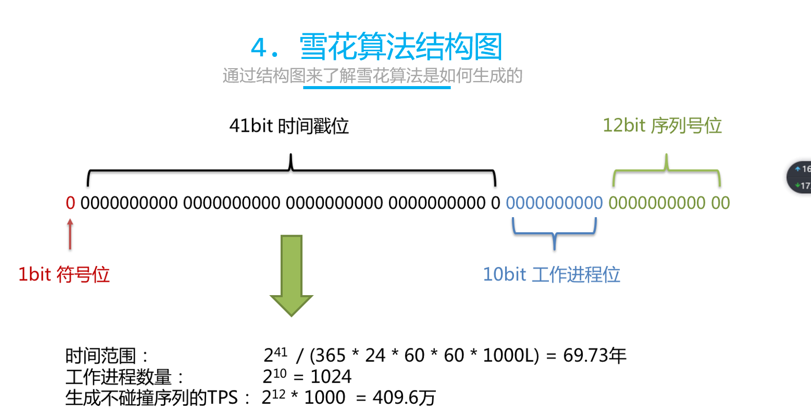

## 数据一致性

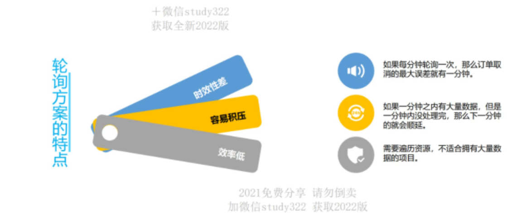


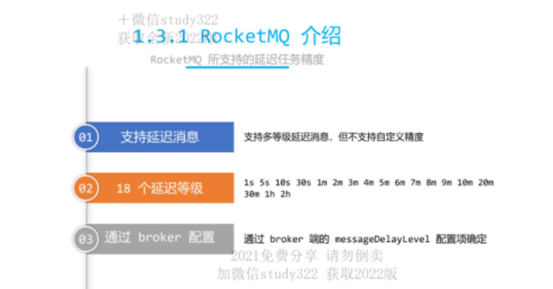

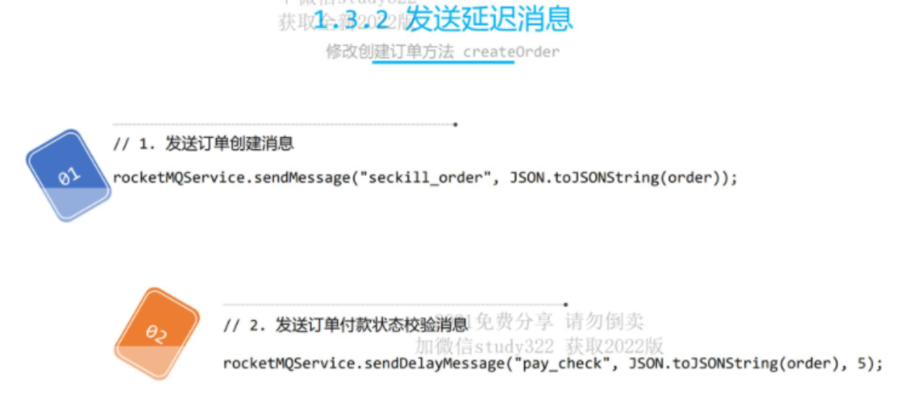

多个系统协作

订单：订单状态改为“已支付”

支付：会有一条支付成功的记录

一致性，多个系统之间数据库不同的，事务不能解决，事务是在同一个数据库中的问题

2、延迟消息

1. 普通的消息

   ​	消息的生产者-》消息队列中-》消息的消费者，立马消费消息

2. 延迟消息

   ​	生成订单，15分钟的支付时间，

   - 时间内完成-》付款成功，发货，库存扣减
   - 时间内没有完成-》支付失败，订单关闭，库存回滚

   生成订单，发延迟信息，15分钟后check 订单支付状态，已经付款状态什么都不做，未付款关闭订单

   消息的生产者-》消息队列中-》消息的消费者过一段时间才消费消息，对消费者不可见，延迟做一件事

   

4、 ROCKETMQ（java），kafak（也支持延迟消息）

消息存储在磁盘中，冗余存储

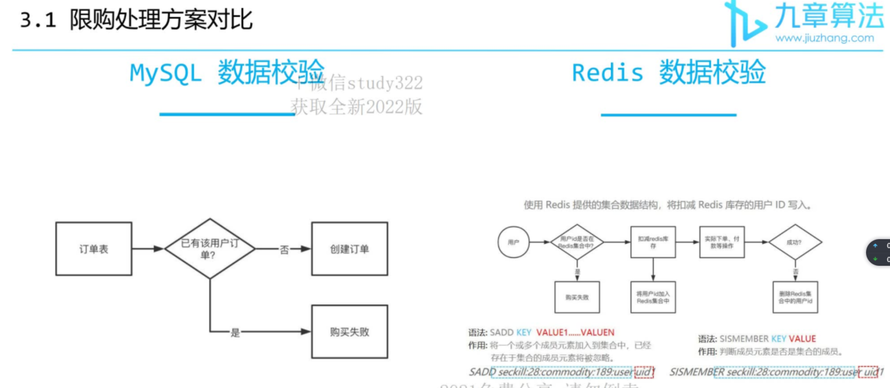

MQ 的两种消费模式

1. 广播消息消费

   消费生产者-》 消息队列 ->消费者1

   ​										  ->消费者1

   ​									所有消费者都可以消费这个信息

2. 集群消息消费

   消息生产者-》消息队列

   ​												消费者组（consumergroup）

   ​												组1

   ​												  ->消费者1

   ​												  ->消费者2

   ​											      同一个消费者组只有一个可以消费

​														->消费者3

​												  	  ->消费者4

Redis 的库存和数据库同步

数据预热的时候放在redis 中就 ok，支付失败，只要订单关闭，需要把冻结的库存补回去 redis 中的库存 + 1

Redis 数据的持久化

RDB ：一段时间快照保存

AOF：所有命令记录

每隔十分钟可以同步一下redis 数据

## 如何利用redis的set 概念限购

```java
/**
     * 添加限购名单
     *
     * @param activityId
     * @param userId
     */
    public void addLimitMember(long activityId, long userId) {
        Jedis jedisClient = jedisPool.getResource();
        jedisClient.sadd("seckillActivity_users:" + activityId, String.valueOf(userId));
        jedisClient.close();
    }

    /**
     * 判断是否在限购名单中
     *
     * @param activityId
     * @param userId
     * @return
     */
    public boolean isInLimitMember(long activityId, long userId) {
        Jedis jedisClient = jedisPool.getResource();
        boolean sismember = jedisClient.sismember("seckillActivity_users:" + activityId, String.valueOf(userId));
        jedisClient.close();
        log.info("userId:{}  activityId:{}  在已购名单中:{}", activityId, userId, sismember);
        return sismember;
    }

    /**
     * 移除限购名单
     *
     * @param activityId
     * @param userId
     */
    public void removeLimitMember(long activityId, long userId) {
        Jedis jedisClient = jedisPool.getResource();
        jedisClient.srem("seckillActivity_users:" + activityId, String.valueOf(userId));
        jedisClient.close();
    }

    /**
     * 超时未支付 Redis 库存回滚
     *
     * @param key
     */
    public void revertStock(String key) {
        Jedis jedisClient = jedisPool.getResource();
        jedisClient.incr(key);
        jedisClient.close();
    }

```

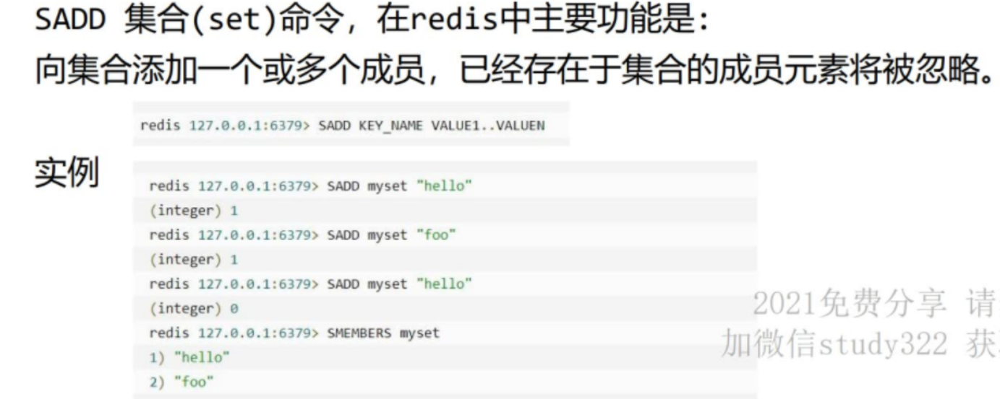

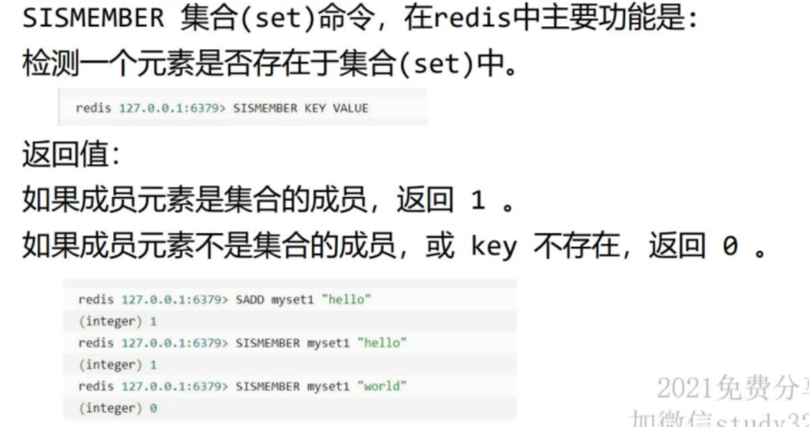


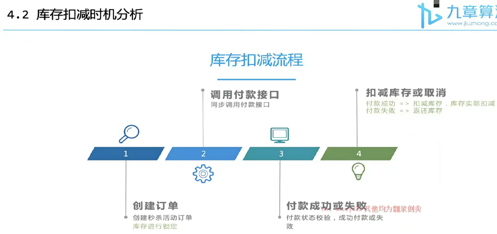

```
同步和异步通常用来形容一次方法的调用。

同步方法的调用必须等到该方法返回后才能继续接下来的行为。

异步方法更像一个消息传递，一旦调用就会立即返回，调用者可以继续接下来的操作，

而异步方法通常会在另一个线程中执行，不会妨碍调用者的工作。
```

**数据库存储在硬盘，redis 存储在内存（所以也不能塞太多），很多系统会调用redis 服务**


## Redis 和RocketMQ流程

**事先写入库存，Redis 是然后请求一开始是在redis抢购，redis返回1 后，创建订单，RocketMQ 发送两个消息创建订单和延迟付款消息，如果consumer判定创建成功（数据库锁定库存且扣减库存）插入订单，一段时间后，如果付款成功，RocketMQ 发送一个pay_done，把数据库锁定的库存，真实扣减（lockstock - 1 available stock 已经在锁定的时候扣减了），如果付款失败，库存就恢复到没锁定前的状态。 order status 都是秒杀活动通过rocketmq 传入的setOrderStatus（order）  来判断支付状态**


## 静态页面

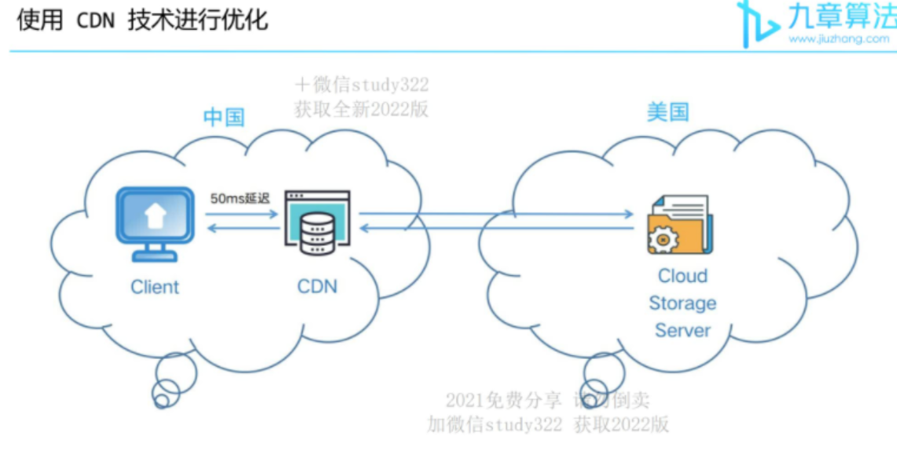


**页面通过Thymeleaf模板引擎渲染后返回客户端，后台需要大量数据查询，每个页面10kb，100w个商品就是10Gb。缓存压力大**

**动态生成的html 变成静态内容保存，用户请求来到，直接访问静态页面。不经过服务器渲染**

**静态的html页面可以部署在nginx服务器（自带负载均衡）中，提供并发能力，减小tomcat压力**

**我们使用Thymeleaf渲染html返回给用户，除了可以写入response，也可以写到本地文件从而实现静态化**


**htmlpageservice**


### Thymeleaf

Thymeleaf is a popular Java template engine that is used to dynamically generate HTML, XML, or other markup languages. It can be used in both server-side and client-side environments, and is often used in combination with web frameworks like Spring MVC, Spring Boot, and Spring Security.

One of the main features of Thymeleaf is its natural template approach, which allows developers to use templates that look very similar to the final output, making them more readable and easier to understand. Thymeleaf also supports a wide range of expressions and features, such as variables, conditionals, loops, and even inline expressions, which can be easily used to create dynamic and interactive web pages.

Thymeleaf also provides a lot of built-in utilities and processors that make it easy to work with common web development tasks, such as form handling, internationalization, and security.

Overall, Thymeleaf is a powerful and flexible template engine that is easy to learn and use. Many developers prefer it over other template engines because of its natural template approach and the ability to work seamlessly with Spring Framework.

## 通过 redis test 提前把商品信息和活动写入redis（预热）

**资源访问的不是数据库了，是redis**

需要一个后台去判断什么时候预热

```java
    public void pushSeckillInfoToRedis(long seckillActivityId) {
        SeckillActivity seckillActivity = seckillActivityDao.querySeckillActivityById(seckillActivityId);
        service.setValue("seckillActivity:" + seckillActivityId, JSON.toJSONString(seckillActivity));

        SeckillCommodity seckillCommodity = seckillCommodityDao.querySeckillCommodityById(seckillActivity.getCommodityId());
        service.setValue("seckillCommodity:" + seckillActivity.getCommodityId(), JSON.toJSONString(seckillCommodity));
    }

```


## 获取活动开始时间

**前端轮询服务器的时间，减少误差并获取距离活动开始的时间差**

## 限流机制


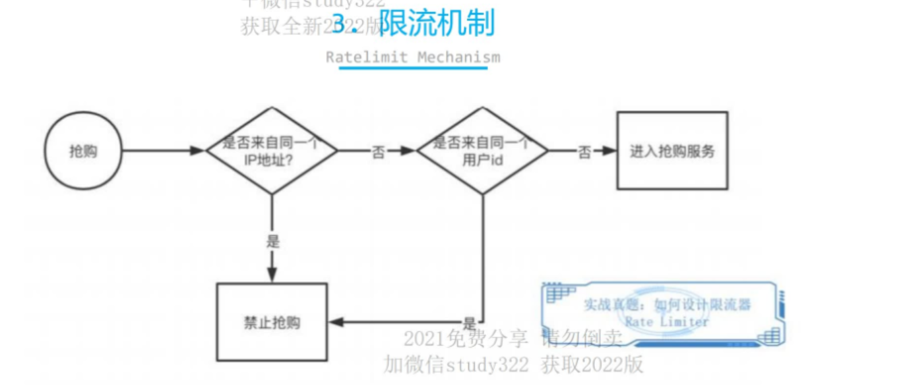

## 分布式锁

Java中的锁主要包括synchronized锁和JUC包中的锁，这些锁都是针对单个JVM实例上的锁，对于分布式环境如果我们需要加锁就显得无能为力。在单个JVM实例上，锁的竞争者通常是一些**不同的线程**，而在分布式环境中，锁的竞争者通常是一些不同的**线程或者进程**。如何实现在分布式环境中对一个对象进行加锁呢？这就需要用到分布式锁

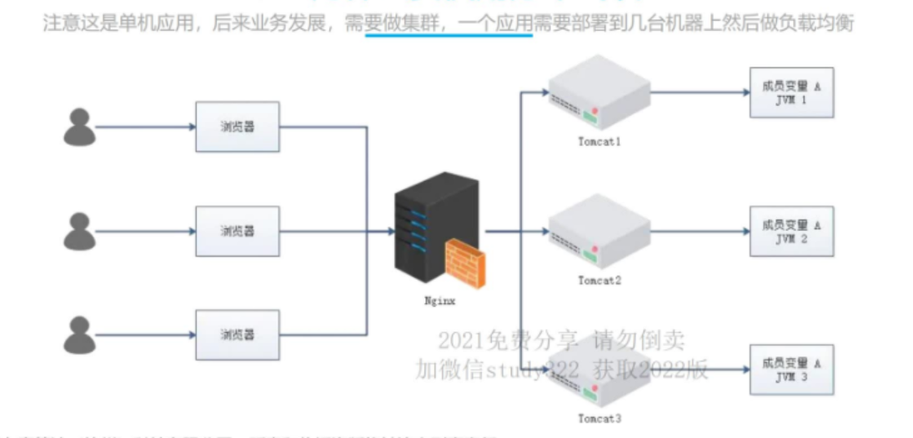

**解决的问题**

为了保证一个方法或属性在高并发情况下的同一时间只能被同一个线程执行，在传统单体应用单机部署的情况下，可以使用并发处理相关的功能进行互斥控制。但是，随着业务发展的需要，原单体单机部署的系统被演化成分布式集群系统后，由于分布式系统多线程、多进程并且分布在不同机器上，这将使原单机部署情况下的并发控制锁策略失效，单纯的应用并不能提供分布式锁的能力。为了解决这个问题就需要一种跨机器的互斥机制来控制共享资源的访问，这就是分布式锁要解决的问题！


### 基于数据库的分布式锁

在数据库中创建一个表，表中包含方法名等字段，并在方法名字段上创建唯一索引，想要执行某个方法，就使用这个方法，并向表中插入数据，成功插入则获取锁，执行完成后删除对应的行数据释放锁。

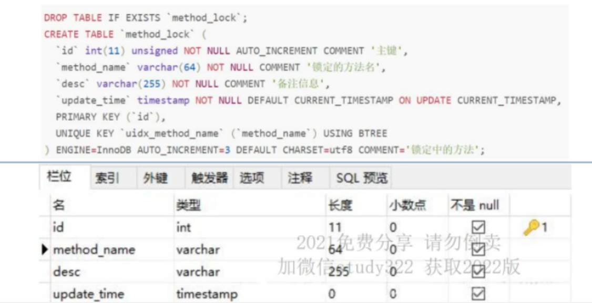

**有可能来在几个不同的及其执行**

```sql
INSERT INTO method_lock(method_name, desc) VALUES ('methodName','测试的methodName');
```


因为我们对method_name做了唯一性约束，这里如果有多个请求同时提交到数据库的话，数据库会保证只有一个操作可以成功，那么我们就可以认为操作成功的那个线程获得了该方法的锁，可以执行方法体内容。

```sql
delete from method_lock where method_name ='methodName';
```

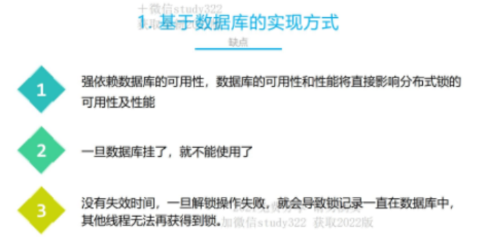


### 基于Redis的分布式锁


**首先获取锁对应的value值，检查是否与requestId相等，如果相等（同一个线程的同一个锁）删除锁（解锁）**

**确保上述操作是原子性的，eval命令执行Lua代码的时候，Lua代码将成为一个命令执行**


### **Redis查询速度为什么这么快**

**1、完全基于内存，绝大部分请求是纯粹的内存操作，非常快速。数据存在内存中，类似于HashMap，HashMap的优势就是查找和操作的时间复杂度都是O(1)；**

**2、数据结构简单，对数据操作也简单，Redis中的数据结构是专门进行设计的；**

**3、采用单线程，避免了不必要的上下文切换和竞争条件，也不存在多进程或者多线程导致的切换而消耗CPU，不用去考虑各种锁的问题，不存在加锁释放锁操作，没有因为可能出现死锁而导致的性能消耗；**

**4、使用多路I/O复用模型，非阻塞IO。**

### 本地缓存（JVM）

本地缓存概念在Client端使用本地缓存，从而降低了redis集群对hotkey的访问量。比如利用GuavaCache是一款面向本地缓存的，轻量级的Cache，适合缓存少量数据。或者用一个HashMap都可以，在你发现热key以后，把热key加载到系统的JVM中。针对这种热key请求，会直接从jvm中取，而不会走到redis层。


### 缓存雪崩 Cache Avalanche（key 集中过期）

过期时间随机设置

数据缓存到不同的数据库

热点数据永不过期

### 缓存穿透 Cache Penetration(没找到key)

数据库miss 后 ，缓存空对象 在redis

bloom filter，储存所有存在的key

### 缓存击穿 Hotspot Invalid（热点失效，直接请求数据库）

延长热点key的过期时间或者设置永不过期
